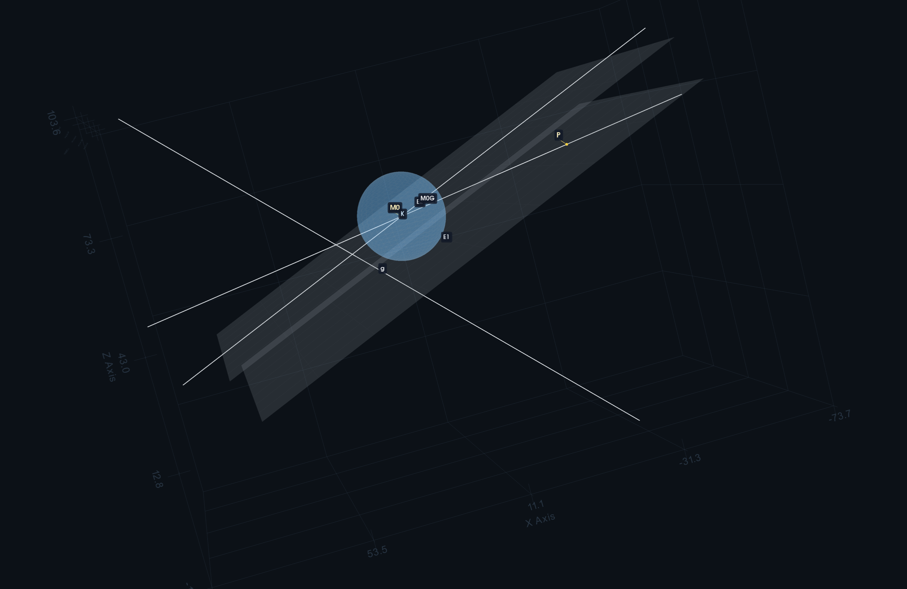
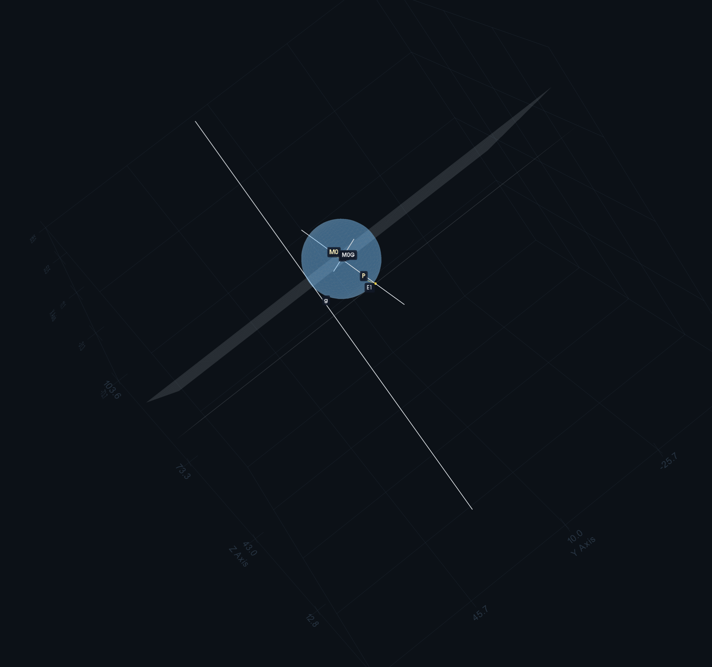

# Example Usage

This scene:

```text
E1 = 5x + 12z - 600 = 0
P = (-36, 10, 65)
E2 = 5x + 12z - 769 = 0
M0 = (17, 10, 57)
K = sphere((17, 10, 57), 13)
g = line((24, 22.75, 40), [12, -1, 12])
M0G = line(M0, [-60, 0, 25])

line(M0, [53, 0, -8])
```

Example render:




